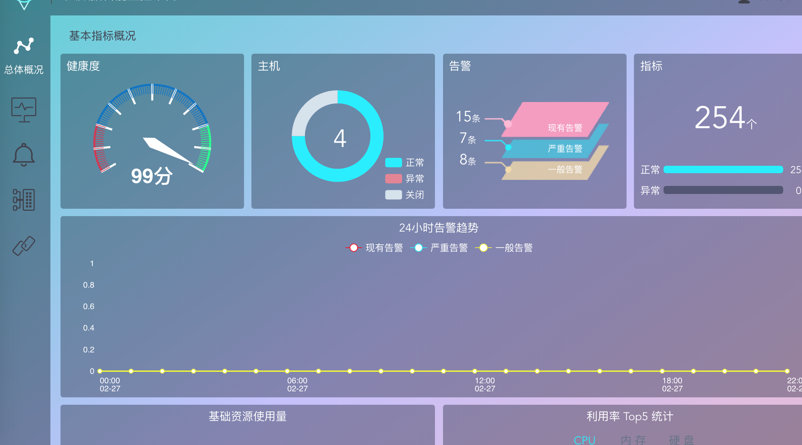
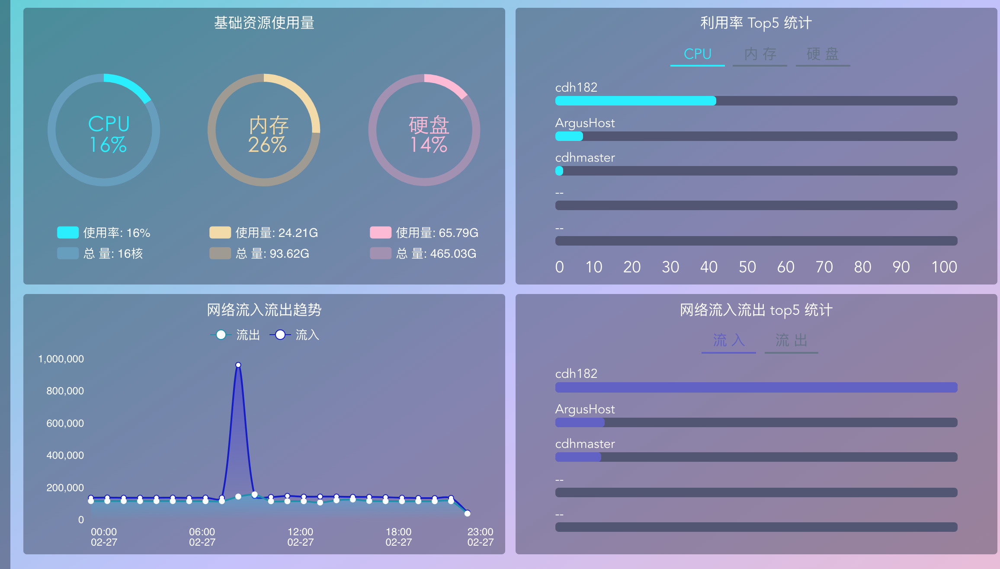
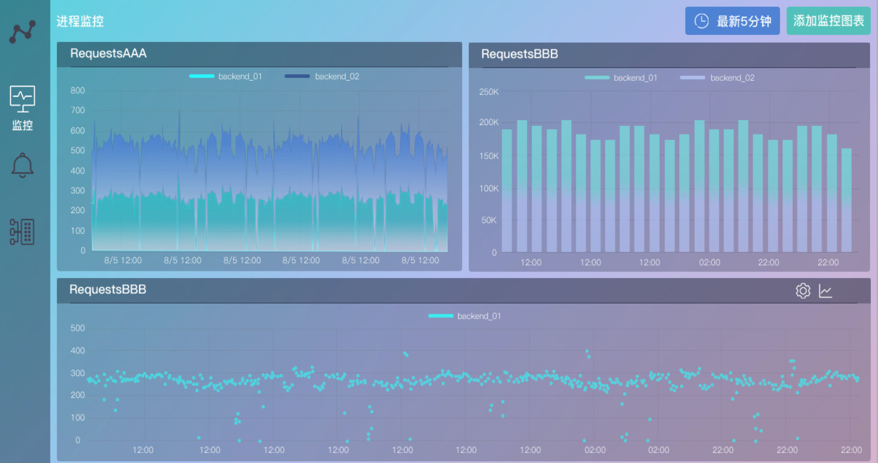
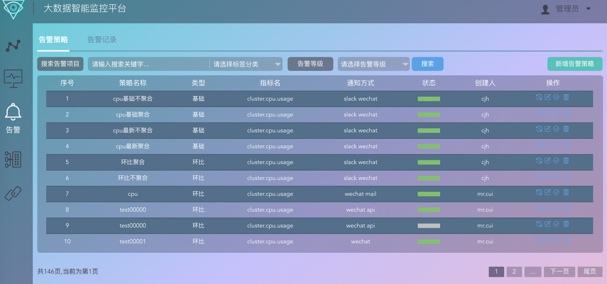
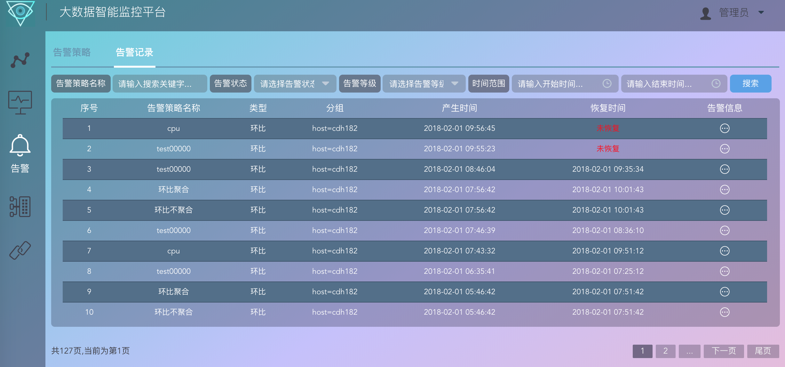
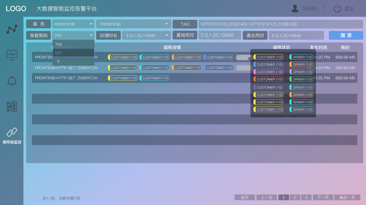
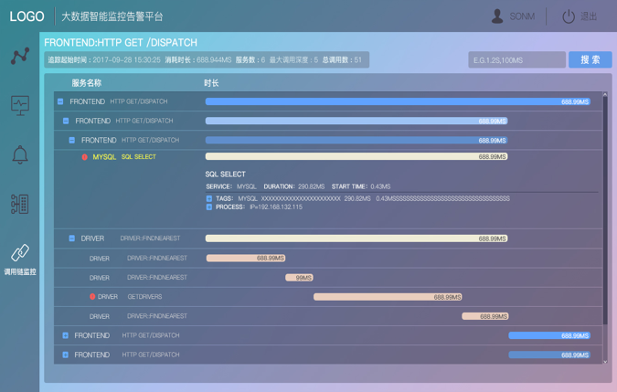

# Amas

[]()

Amas is recursive acronym for “Amas, monitor alert system”.

Language: [English](README.md) | [中文](README_ch.md)


## What is Amas
Amas is a monitor alert system based on OpenTSDB, for big-data platform, with its features：  
1. Provide lots of metrics on big-data platform(Hadoop/Spark/HBase/Kakfa...)
2. Highly extensible collector agent, support custom metrics written by different scripting language(Python/Perl/Shell/...)
3. Able to read/write mass data quickly due to HBase/OpenTSDB
4. Web UI is sexy, powerful and easy to use
5. Easily extend system processing ability on its distributed alert engine
6. Callchain metric collect and display based on OpenTracing
7. Multi-channel and customizable notify method, wechat/mail/slack already support
8. Docker and swarm support
9. (More...)


## Authors
Amas is maintained by [@Eacon](https://github.com/EaconTang) and his develop team, see more in [AUTHORS](AUTHORS).


## Technology Stack
* Program language：Python, NodeJS
* Web Service：Vue, ECharts, Express
* Backend Service：
    - HBase, OpenTSDB, MongoDB, Redis
    - Spark, Kafka...
    - Jagger, Tornado
    - Docker, Swarm


## Runtime Environment
* Linux(Kernel2.6+)
* Centos7(Recommend)

## Note
* Amas' code name is "argus", and this would be reserved in source code.


<!--
## Docker快捷部署

1）如果你了解并安装了Docker，可以用以下命令一键运行，快速体验其界面功能：
```

```
2）如果你熟悉容器编排Docker-Compose，推荐使用以下方式运行：
```

``` -->
<!--

## 生产环境部署指南
 -->

## Screenshots
  
  
  
  
  
  
  


<!-- ## 技术架构 -->
